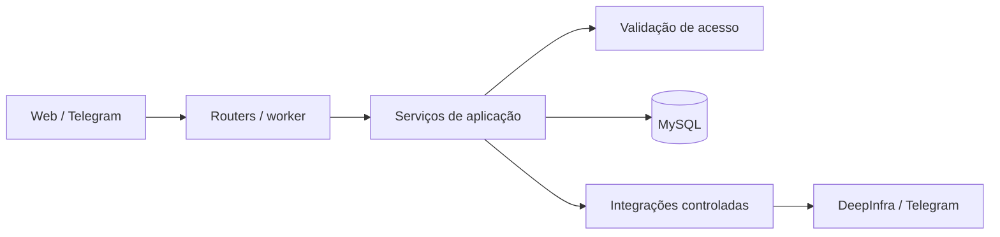

# Plano de refatoração

## Objetivo

Consolidar o VitoriaFinance antes de ampliar o escopo funcional, reduzindo risco
de segurança e acoplamento sem reescrever o sistema nem alterar o comportamento
observável.

Este plano parte do estado verificado em 29/07/2026:

- 41 testes passando em SQLite;
- `app/routers/web.py` com cerca de 102 KB e mais de 70 handlers e helpers;
- regras de domínio já parcialmente extraídas para `app/services/`;
- tokens de DeepInfra e Telegram persistidos em texto no banco;
- seed e documentação com credencial fixa `vh / 123456`;
- CI validando testes e migrations somente em SQLite;
- produção documentada para MySQL 8+;
- 265 avisos de uso de `datetime.utcnow()` na suíte atual.

## Princípios

1. Refatorar em passos pequenos, mantendo a aplicação executável após cada PR.
2. Criar testes de caracterização antes de mover uma regra de negócio.
3. Separar transporte HTTP, aplicação, domínio e persistência sem impor uma
   arquitetura excessiva ao monólito.
4. Preservar URLs, nomes de formulários, templates e comportamento durante a
   extração.
5. Manter autorização no backend e testá-la em cada fronteira pública.
6. Não criar uma camada de repositórios genérica. Extrair consultas nomeadas
   apenas quando forem reutilizadas, complexas ou importantes para isolamento.
7. Fazer alterações de schema e segredo com estratégia explícita de migração e
   rollback.

## Arquitetura-alvo pragmática

```text
app/
  routers/
    auth.py
    dashboard.py
    analysis.py
    transactions.py
    recurrences.py
    cards.py
    financing.py
    profile.py
    account_admin.py
    system_admin.py
    shared.py
  services/
    access_context.py
    transaction_service.py
    recurrence_service.py
    monthly_closing_service.py
    projection_service.py
    card_service.py
    financing_service.py
    settings_service.py
    ...
  integrations/
    deepinfra.py
    telegram.py
  models.py
```

Responsabilidades:

- **router:** ler entrada HTTP, chamar serviço e produzir resposta, redirect ou
  template;
- **service:** controlar caso de uso, autorização de domínio, transação e regras;
- **consulta nomeada:** encapsular consultas complexas ou compartilhadas, sem
  introduzir CRUD genérico;
- **integration:** encapsular HTTP e erros dos serviços externos;
- **model:** mapear persistência e invariantes simples.

`models.py` pode continuar unificado durante esta iniciativa. Dividi-lo agora
ampliaria o diff sem atacar o principal risco.

## Fase 0 — Baseline e proteção da refatoração

### PR 1 — Testes de caracterização e disciplina de suíte

- Marcar testes como `unit` e `integration`.
- Isolar o banco SQLite por execução/worker em arquivo temporário, em vez de
  reutilizar `test_vitoria.db`.
- Adicionar testes de caracterização para:
  - fechamento e reabertura mensal;
  - confirmação, pagamento parcial e salto de recorrências;
  - parcelamento e período de fatura;
  - amortização de financiamento;
  - isolamento por conta, workspace e área financeira;
  - tentativa de escrita por usuário somente leitura.
- Registrar o tempo da suíte e remover dependência entre testes.

**Concluído quando:** a suíte protege os fluxos que serão extraídos, pode rodar
em paralelo sem colisão e continua verde.

### PR 2 — Datas UTC e configuração segura

- Criar um helper/clock injetável para horário UTC.
- Migrar `datetime.utcnow()` para datetimes UTC conscientes.
- Fazer a aplicação falhar em ambiente não-desenvolvimento quando
  `SECRET_KEY=change-me` ou quando a configuração obrigatória estiver ausente.
- Adicionar testes da validação de configuração.

**Concluído quando:** os avisos de `utcnow()` do código da aplicação desaparecem
e configurações inseguras não iniciam produção/homologação.

## Fase 1 — Segurança prioritária

### PR 3 — Cofre de configurações

- Adicionar `SECRET_ENCRYPTION_KEY` separado de `SECRET_KEY`.
- Introduzir um serviço de configurações com `get`, `set` e mascaramento de
  segredos.
- Criptografar com esquema autenticado e versionado, por exemplo
  `enc:v1:<payload>`.
- Fazer leitura compatível com valores legados em texto durante a migração.
- Nunca registrar valor descriptografado, chave ou token.
- Atualizar web, agente e worker para consumir somente o serviço.
- Adicionar testes de round-trip, chave incorreta, payload adulterado,
  mascaramento e compatibilidade legada.

### PR 4 — Migração dos segredos existentes

- Criar comando administrativo idempotente para criptografar valores legados.
- Exigir backup antes da execução.
- Implantar em duas etapas:
  1. código que lê texto e criptografia, mas sempre grava criptografado;
  2. executar migração e verificar que não restam segredos legados.
- Documentar rotação da chave: chave nova + chave anterior durante janela de
  transição, recriptografia e remoção da chave anterior.

**Rollback:** preservar backup e manter a versão anterior da chave disponível.
Nunca substituir valores sem antes validar que podem ser descriptografados.

### PR 5 — Remoção da credencial padrão

- Fazer o seed receber credenciais por `INITIAL_ADMIN_USERNAME` e
  `INITIAL_ADMIN_PASSWORD`, ou gerar senha aleatória exibida uma única vez.
- Tornar seed de demonstração explícito com `DEMO_MODE=true`.
- Remover `vh / 123456` do README e do guia de instalação.
- Definir política mínima de senha e exigir troca inicial se uma senha temporária
  for usada.
- Revisar a migration histórica de seed: não alterá-la se já tiver sido aplicada
  em ambientes compartilhados; criar uma migration/ação corretiva nova.

**Concluído quando:** uma instalação normal não cria conta com senha conhecida e
dumps do banco não expõem tokens utilizáveis.

## Fase 2 — Extração das regras de domínio

Extrair primeiro as regras de maior risco, mantendo os handlers atuais como
adaptadores finos.

### PR 6 — Recorrências e fechamento mensal

- Criar `recurrence_service.py` para confirmar, pagar parcialmente, saltar,
  editar e excluir regras/ocorrências.
- Criar `monthly_closing_service.py` para fechar e reabrir competência.
- Centralizar validações de período, idempotência e permissão.
- Manter commit/rollback na fronteira do caso de uso.

### PR 7 — Cartões e transações

- Expandir `card_billing.py`/criar `card_service.py` para período de fatura,
  parcelamento, confirmação e reabertura.
- Criar `transaction_service.py` para criação, edição, exclusão e confirmação.
- Garantir uso consistente de `Decimal` e política explícita de arredondamento.

### PR 8 — Financiamentos e projeções

- Criar `financing_service.py` para criação, edição e amortização.
- Criar `projection_service.py` para dashboard, análise histórica e saldo livre.
- Fazer o agente do Telegram e a interface web chamarem os mesmos casos de uso
  onde houver comportamento equivalente.

**Concluído quando:** as regras financeiras prioritárias podem ser testadas sem
`TestClient`, e os handlers correspondentes apenas validam entrada, chamam um
caso de uso e formatam a resposta.

## Fase 3 — Divisão do router

### PR 9 — Infraestrutura compartilhada e integrações

- Mover `render`, `flash`, `redirect` e parsing comum para `routers/shared.py`.
- Manter dependências de autenticação/autorização em local único.
- Extrair chamadas DeepInfra de `web.py` para `integrations/deepinfra.py`.
- Remover `set_system_setting` do router em favor do serviço seguro.

### PRs 10 a 12 — Routers por domínio

Mover rotas sem alterar paths:

1. `auth`, `profile`, `account_admin` e `system_admin`;
2. `transactions`, `recurrences`, `cards` e `financing`;
3. `dashboard` e `analysis`.

Registrar todos em `app/main.py`. Cada PR deve remover do `web.py` somente o
grupo coberto por seus testes.

**Concluído quando:** `web.py` deixa de existir, ou fica temporariamente apenas
como agregador sem regra de negócio; nenhum router conhece token externo em
texto ou implementa cálculo financeiro.

## Fase 4 — Paridade com MySQL no CI

### PR 13 — Job de integração MySQL 8

- Manter a etapa rápida em SQLite.
- Adicionar serviço MySQL 8 em runner compatível, com health check.
- Rodar `alembic upgrade head` em banco vazio.
- Executar testes marcados `integration` usando `DATABASE_URL` MySQL.
- Validar ao menos:
  - `Decimal` e arredondamento;
  - enums, constraints, chaves estrangeiras e cascatas;
  - datas e timezone;
  - concorrência/idempotência de confirmação;
  - migrations do zero e upgrade a partir de um snapshot suportado.
- Evitar acoplar a validação principal exclusivamente ao runner
  `self-hosted`; usar runner hospedado para testes quando possível e reservar
  self-hosted para deploy.

**Concluído quando:** um PR não pode ser aprovado se migrations ou fluxos
financeiros críticos falharem no MySQL suportado.

## Fase 5 — Consolidação do portfólio

Esta fase não bloqueia a refatoração interna e pode ocorrer em paralelo depois
da fase de segurança.

### PR 14 — Documentação arquitetural

- Atualizar `docs/arquitetura.md` com Mermaid:



- Destacar a fronteira `IA -> ferramentas -> permissão -> serviço -> banco`.
- Registrar decisões curtas sobre criptografia, confirmação de escrita e
  SQLite/MySQL.

### PR 15 — Apresentação

- Adicionar screenshots com dados inteiramente fictícios.
- Incluir um GIF ou vídeo curto do fluxo Telegram com confirmação.
- Corrigir instruções de demonstração após a remoção da senha fixa.
- Decidir conscientemente entre licença explícita, todos os direitos reservados
  ou repositório privado.

O roadmap já usa `[x]` para recursos entregues e `[ ]` para pendências; portanto,
não há correção visual necessária nesse ponto.

## Ordem e dependências

```text
PR 1 baseline
 ├─> PR 2 datas/configuração
 ├─> PR 3 cofre ─> PR 4 migração ─> PR 5 credencial inicial
 └─> PR 6 recorrências ─> PR 7 cartões/transações ─> PR 8 financiamento/projeção
                                                └─> PR 9-12 divisão dos routers

PR 1 ─> PR 13 MySQL CI
PR 5 ─> PR 14-15 documentação e apresentação
```

## Critérios globais de aceite

- Suíte SQLite e suíte MySQL verdes.
- Nenhuma mudança involuntária em URLs ou contratos de formulário.
- Nenhum segredo persistido ou registrado em texto.
- Autorização negativa coberta por testes para cada operação de escrita.
- Valores monetários sempre representados por `Decimal`, com arredondamento
  definido e testado.
- Migrations testadas do zero e com procedimento de rollback documentado.
- Cada PR revisável de forma independente e sem misturar refatoração com nova
  funcionalidade.

## Fora do escopo desta iniciativa

- Reescrever o monólito como microserviços.
- Trocar FastAPI, SQLAlchemy, Jinja2 ou MySQL.
- Criar repositories genéricos para todas as entidades.
- Dividir `models.py` apenas por estética.
- Adicionar novas funções financeiras antes da consolidação.
- Alterar UX durante a movimentação de código.

## Primeiro ciclo recomendado

Começar pelos PRs 1 a 5. Esse ciclo entrega proteção de regressão e fecha os
dois riscos de segurança mais claros antes de qualquer movimentação estrutural.
Depois, executar os PRs 6 a 12 por fatias verticais, sempre movendo teste, regra
e endpoint do mesmo domínio no mesmo ciclo.
